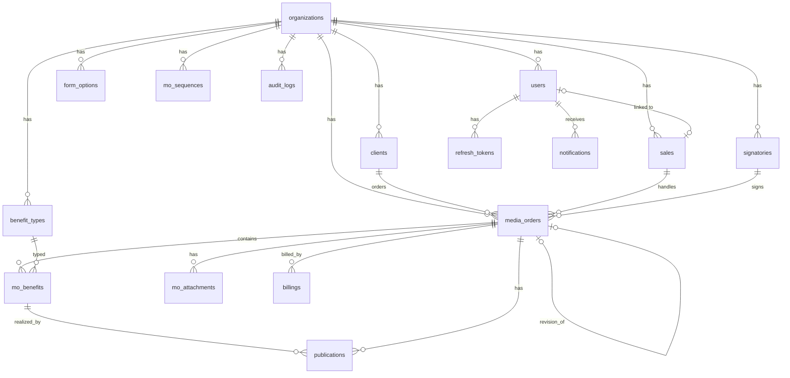

# DATABASE.md

Skema dan aturan database PostgreSQL 16 untuk Sistem Manajemen Klien & Media Order (MO) Inilah.com.
ORM yang dipakai adalah Prisma. Fitur yang tidak didukung Prisma (CHECK constraint, trigram index, view) ditambahkan lewat migration SQL manual (§7).

## 1. Konvensi

| Hal | Aturan |
|---|---|
| Primary key | `id UUID DEFAULT gen_random_uuid()` |
| Nama tabel & kolom | `snake_case`, tabel dalam bentuk jamak |
| Field Prisma | `camelCase` dengan `@map` / `@@map` |
| Timestamp | `created_at`, `updated_at` bertipe `TIMESTAMPTZ`, disimpan UTC |
| Tanggal bisnis | `DATE` (`mo_date`, `period_start`, `period_end`, `published_date`) |
| Uang | `NUMERIC(18,2)` dan tidak pernah `REAL`/`DOUBLE` |
| Multi-tenant | Semua tabel bisnis punya `organization_id` (FK + index) |
| Soft delete | `deleted_at` hanya untuk `users` dan `clients`. MO tidak dihapus; MO dibatalkan (`CANCELLED`), kecuali Draft yang boleh dihapus fisik |
| Snapshot | Data yang harus tetap sama seperti saat MO terbit disimpan sebagai `JSONB` di `media_orders` |
| Ekstensi | `pgcrypto` (UUID), `pg_trgm` (pencarian nama perusahaan) |

## 2. ERD



## 3. Enum

| Enum | Nilai |
|---|---|
| `Role` | `SUPER_ADMIN`, `ADMIN_SALES`, `FINANCE`, `VIEWER` |
| `MoStatus` | `DRAFT`, `SUBMITTED`, `ACTIVE`, `COMPLETED`, `CANCELLED` |
| `BillingStatus` | `NOT_READY`, `READY_TO_BILL`, `BILLED`, `PAID` |
| `PaymentMethod` | `TRANSFER`, `CHEQUE_BG` |
| `SignatoryRole` | `ACKNOWLEDGED_BY`, `APPROVED_BY` |
| `FormOptionGroup` | `AD_TYPE`, `COOP_TYPE`, `PLACEMENT`, `AD_LOCATION` |
| `AuditAction` | `CREATE`, `UPDATE`, `DELETE`, `SUBMIT`, `CANCEL`, `REVISE`, `STATUS_CHANGE`, `LOGIN` |
| `NotificationType` | `MO_READY_TO_BILL`, `MO_PERIOD_ENDING`, `MO_BILLING_OVERRIDE` |

Penandatangan "Dibuat oleh" selalu diambil dari sales pada MO, sehingga tidak perlu enum tersendiri.

## 4. Prisma Schema

```prisma
generator client {
  provider        = "prisma-client-js"
  previewFeatures = ["postgresqlExtensions"]
}

datasource db {
  provider   = "postgresql"
  url        = env("DATABASE_URL")
  extensions = [pgcrypto, pg_trgm]
}

// ─────────────── Organisasi & Pengguna ───────────────

model Organization {
  id              String   @id @default(dbgenerated("gen_random_uuid()")) @db.Uuid
  name            String
  address         String
  logoKey         String?  @map("logo_key")
  bankName        String   @map("bank_name")
  bankAccountNo   String   @map("bank_account_no")
  bankAccountName String   @map("bank_account_name")
  /// { tax: { ppnRate, dppNum, dppDen }, numbering: { template, seqPad },
  ///   requiredClientFields: string[], defaultTermsTemplates: string[] }
  settings        Json     @default("{}")
  createdAt       DateTime @default(now()) @map("created_at") @db.Timestamptz
  updatedAt       DateTime @updatedAt @map("updated_at") @db.Timestamptz

  users         User[]
  sales         Sales[]
  clients       Client[]
  signatories   Signatory[]
  benefitTypes  BenefitType[]
  formOptions   FormOption[]
  moSequences   MoSequence[]
  mediaOrders   MediaOrder[]
  auditLogs     AuditLog[]

  @@map("organizations")
}

model User {
  id             String    @id @default(dbgenerated("gen_random_uuid()")) @db.Uuid
  organizationId String    @map("organization_id") @db.Uuid
  name           String
  email          String
  passwordHash   String    @map("password_hash")
  role           Role
  isActive       Boolean   @default(true) @map("is_active")
  salesId        String?   @unique @map("sales_id") @db.Uuid
  lastLoginAt    DateTime? @map("last_login_at") @db.Timestamptz
  deletedAt      DateTime? @map("deleted_at") @db.Timestamptz
  createdAt      DateTime  @default(now()) @map("created_at") @db.Timestamptz
  updatedAt      DateTime  @updatedAt @map("updated_at") @db.Timestamptz

  organization  Organization   @relation(fields: [organizationId], references: [id])
  sales         Sales?         @relation(fields: [salesId], references: [id])
  refreshTokens RefreshToken[]
  notifications Notification[]

  @@unique([organizationId, email])
  @@map("users")
}

model RefreshToken {
  id         String    @id @default(dbgenerated("gen_random_uuid()")) @db.Uuid
  userId     String    @map("user_id") @db.Uuid
  tokenHash  String    @unique @map("token_hash")
  expiresAt  DateTime  @map("expires_at") @db.Timestamptz
  revokedAt  DateTime? @map("revoked_at") @db.Timestamptz
  userAgent  String?   @map("user_agent")
  createdAt  DateTime  @default(now()) @map("created_at") @db.Timestamptz

  user User @relation(fields: [userId], references: [id], onDelete: Cascade)

  @@index([userId])
  @@map("refresh_tokens")
}

// ─────────────── Master Data ───────────────

model Sales {
  id             String   @id @default(dbgenerated("gen_random_uuid()")) @db.Uuid
  organizationId String   @map("organization_id") @db.Uuid
  name           String
  code           String   /// dipakai di nomor MO, mis. "BMO"
  email          String?
  title          String   @default("Sales")
  signatureKey   String?  @map("signature_key")
  isActive       Boolean  @default(true) @map("is_active")
  createdAt      DateTime @default(now()) @map("created_at") @db.Timestamptz
  updatedAt      DateTime @updatedAt @map("updated_at") @db.Timestamptz

  organization Organization @relation(fields: [organizationId], references: [id])
  user         User?
  mediaOrders  MediaOrder[]

  @@unique([organizationId, code])
  @@map("sales")
}

model Signatory {
  id             String        @id @default(dbgenerated("gen_random_uuid()")) @db.Uuid
  organizationId String        @map("organization_id") @db.Uuid
  name           String
  title          String
  docRole        SignatoryRole @map("doc_role")
  signatureKey   String?       @map("signature_key")
  stampKey       String?       @map("stamp_key")
  isDefault      Boolean       @default(false) @map("is_default")
  isActive       Boolean       @default(true) @map("is_active")
  createdAt      DateTime      @default(now()) @map("created_at") @db.Timestamptz
  updatedAt      DateTime      @updatedAt @map("updated_at") @db.Timestamptz

  organization     Organization @relation(fields: [organizationId], references: [id])
  acknowledgedMos  MediaOrder[] @relation("AcknowledgedBy")
  approvedMos      MediaOrder[] @relation("ApprovedBy")

  @@index([organizationId, docRole])
  @@map("signatories")
}

model BenefitType {
  id             String   @id @default(dbgenerated("gen_random_uuid()")) @db.Uuid
  organizationId String   @map("organization_id") @db.Uuid
  code           String   /// ARTIKEL_RILIS, INSTAGRAM, ...
  name           String
  pdfLabel       String?  @map("pdf_label") /// teks untuk auto-generate Detail Kerjasama
  sortOrder      Int      @default(0) @map("sort_order")
  isActive       Boolean  @default(true) @map("is_active")
  createdAt      DateTime @default(now()) @map("created_at") @db.Timestamptz
  updatedAt      DateTime @updatedAt @map("updated_at") @db.Timestamptz

  organization Organization @relation(fields: [organizationId], references: [id])
  moBenefits   MoBenefit[]

  @@unique([organizationId, code])
  @@map("benefit_types")
}

model FormOption {
  id             String          @id @default(dbgenerated("gen_random_uuid()")) @db.Uuid
  organizationId String          @map("organization_id") @db.Uuid
  group          FormOptionGroup
  code           String
  label          String
  parentCode     String?         @map("parent_code")
  sortOrder      Int             @default(0) @map("sort_order")
  isActive       Boolean         @default(true) @map("is_active")

  organization Organization @relation(fields: [organizationId], references: [id])

  @@unique([organizationId, group, code])
  @@map("form_options")
}

// ─────────────── Klien ───────────────

model Client {
  id             String    @id @default(dbgenerated("gen_random_uuid()")) @db.Uuid
  organizationId String    @map("organization_id") @db.Uuid
  picName        String    @map("pic_name")
  companyName    String    @map("company_name")
  nik            String?
  npwp           String?
  address        String?
  city           String?
  postalCode     String?   @map("postal_code")
  email          String?
  phone          String?
  notes          String?
  deletedAt      DateTime? @map("deleted_at") @db.Timestamptz
  createdBy      String    @map("created_by") @db.Uuid
  createdAt      DateTime  @default(now()) @map("created_at") @db.Timestamptz
  updatedAt      DateTime  @updatedAt @map("updated_at") @db.Timestamptz

  organization Organization @relation(fields: [organizationId], references: [id])
  mediaOrders  MediaOrder[]

  @@index([organizationId])
  @@map("clients")
}

// ─────────────── Media Order ───────────────

model MoSequence {
  organizationId String @map("organization_id") @db.Uuid
  year           Int
  lastSeq        Int    @default(0) @map("last_seq")

  organization Organization @relation(fields: [organizationId], references: [id])

  @@id([organizationId, year])
  @@map("mo_sequences")
}

model MediaOrder {
  id             String        @id @default(dbgenerated("gen_random_uuid()")) @db.Uuid
  organizationId String        @map("organization_id") @db.Uuid
  moNumber       String?       @map("mo_number")
  moSeq          Int?          @map("mo_seq")
  moYear         Int?          @map("mo_year")
  moDate         DateTime      @map("mo_date") @db.Date

  clientId       String        @map("client_id") @db.Uuid
  clientSnapshot Json?         @map("client_snapshot")
  salesId        String        @map("sales_id") @db.Uuid

  periodStart    DateTime      @map("period_start") @db.Date
  periodEnd      DateTime      @map("period_end") @db.Date
  description    String?       /// "Keterangan"
  airingDateText String?       @map("airing_date_text")
  /// { AD_TYPE: string[], COOP_TYPE: string[], PLACEMENT: string[], AD_LOCATION: string[] }
  selectedOptions Json         @default("{}") @map("selected_options")
  cooperationDetail String?    @map("cooperation_detail")
  termsConditions   String?    @map("terms_conditions")

  paymentMethod  PaymentMethod @default(TRANSFER) @map("payment_method")
  chequeNo       String?       @map("cheque_no")
  receiptNo      String?       @map("receipt_no")
  dueDateText    String?       @map("due_date_text")
  adProduct      String?       @map("ad_product")

  isTaxable      Boolean       @default(true) @map("is_taxable")
  subtotal       Decimal       @default(0) @db.Decimal(18, 2)
  dppAmount      Decimal       @default(0) @map("dpp_amount") @db.Decimal(18, 2)
  ppnAmount      Decimal       @default(0) @map("ppn_amount") @db.Decimal(18, 2)
  totalAmount    Decimal       @default(0) @map("total_amount") @db.Decimal(18, 2)
  ppnRate        Decimal       @default(12) @map("ppn_rate") @db.Decimal(5, 2)
  dppFactorNum   Int           @default(11) @map("dpp_factor_num")
  dppFactorDen   Int           @default(12) @map("dpp_factor_den")

  acknowledgedById String?     @map("acknowledged_by_id") @db.Uuid
  approvedById     String?     @map("approved_by_id") @db.Uuid
  /// { createdBy: {name,title,signatureKey}, acknowledgedBy: {...}, approvedBy: {..., stampKey} }
  signatorySnapshot Json?      @map("signatory_snapshot")

  status          MoStatus      @default(DRAFT)
  billingStatus   BillingStatus @default(NOT_READY) @map("billing_status")
  fulfillmentPct  Decimal       @default(0) @map("fulfillment_pct") @db.Decimal(5, 2)
  cancelReason    String?       @map("cancel_reason")
  revisionOfMoId  String?       @unique @map("revision_of_mo_id") @db.Uuid
  pdfKey          String?       @map("pdf_key")
  periodEndingNotifiedAt DateTime? @map("period_ending_notified_at") @db.Timestamptz

  submittedAt    DateTime?     @map("submitted_at") @db.Timestamptz
  submittedBy    String?       @map("submitted_by") @db.Uuid
  cancelledAt    DateTime?     @map("cancelled_at") @db.Timestamptz
  createdBy      String        @map("created_by") @db.Uuid
  createdAt      DateTime      @default(now()) @map("created_at") @db.Timestamptz
  updatedAt      DateTime      @updatedAt @map("updated_at") @db.Timestamptz

  organization   Organization  @relation(fields: [organizationId], references: [id])
  client         Client        @relation(fields: [clientId], references: [id])
  sales          Sales         @relation(fields: [salesId], references: [id])
  acknowledgedBy Signatory?    @relation("AcknowledgedBy", fields: [acknowledgedById], references: [id])
  approvedBy     Signatory?    @relation("ApprovedBy", fields: [approvedById], references: [id])
  revisionOf     MediaOrder?   @relation("Revision", fields: [revisionOfMoId], references: [id])
  revisedInto    MediaOrder?   @relation("Revision")
  benefits       MoBenefit[]
  publications   Publication[]
  attachments    MoAttachment[]
  billings       Billing[]

  @@unique([organizationId, moNumber])
  @@unique([organizationId, moYear, moSeq])
  @@index([organizationId, moDate])
  @@index([organizationId, periodStart, periodEnd])
  @@index([organizationId, status])
  @@index([organizationId, billingStatus])
  @@index([clientId])
  @@index([salesId])
  @@map("media_orders")
}

model MoBenefit {
  id            String   @id @default(dbgenerated("gen_random_uuid()")) @db.Uuid
  mediaOrderId  String   @map("media_order_id") @db.Uuid
  benefitTypeId String   @map("benefit_type_id") @db.Uuid
  targetQty     Int      @map("target_qty")
  realizedQty   Int      @default(0) @map("realized_qty") /// non-bonus, di-cap di aplikasi
  bonusQty      Int      @default(0) @map("bonus_qty")
  notes         String?
  sortOrder     Int      @default(0) @map("sort_order")

  mediaOrder   MediaOrder    @relation(fields: [mediaOrderId], references: [id], onDelete: Cascade)
  benefitType  BenefitType   @relation(fields: [benefitTypeId], references: [id])
  publications Publication[]

  @@unique([mediaOrderId, benefitTypeId])
  @@map("mo_benefits")
}

model Publication {
  id            String   @id @default(dbgenerated("gen_random_uuid()")) @db.Uuid
  mediaOrderId  String   @map("media_order_id") @db.Uuid
  moBenefitId   String   @map("mo_benefit_id") @db.Uuid
  publishedDate DateTime @map("published_date") @db.Date
  title         String?
  url           String
  urlNormalized String   @map("url_normalized") /// lowercase host, tanpa query utm_*, tanpa trailing slash
  screenshotKey String?  @map("screenshot_key")
  isBonus       Boolean  @default(false) @map("is_bonus")
  notes         String?
  createdBy     String   @map("created_by") @db.Uuid
  createdAt     DateTime @default(now()) @map("created_at") @db.Timestamptz
  updatedAt     DateTime @updatedAt @map("updated_at") @db.Timestamptz

  mediaOrder MediaOrder @relation(fields: [mediaOrderId], references: [id], onDelete: Cascade)
  moBenefit  MoBenefit  @relation(fields: [moBenefitId], references: [id], onDelete: Cascade)

  @@unique([mediaOrderId, urlNormalized])
  @@index([moBenefitId])
  @@index([publishedDate])
  @@map("publications")
}

model MoAttachment {
  id           String   @id @default(dbgenerated("gen_random_uuid()")) @db.Uuid
  mediaOrderId String   @map("media_order_id") @db.Uuid
  fileKey      String   @map("file_key")
  fileName     String   @map("file_name")
  mimeType     String   @map("mime_type")
  sizeBytes    Int      @map("size_bytes")
  isSignedMo   Boolean  @default(true) @map("is_signed_mo")
  uploadedBy   String   @map("uploaded_by") @db.Uuid
  createdAt    DateTime @default(now()) @map("created_at") @db.Timestamptz

  mediaOrder MediaOrder @relation(fields: [mediaOrderId], references: [id], onDelete: Cascade)

  @@index([mediaOrderId])
  @@map("mo_attachments")
}

model Billing {
  id             String    @id @default(dbgenerated("gen_random_uuid()")) @db.Uuid
  mediaOrderId   String    @map("media_order_id") @db.Uuid
  invoiceNo      String    @map("invoice_no")
  invoiceDate    DateTime  @map("invoice_date") @db.Date
  amount         Decimal   @db.Decimal(18, 2)
  paidDate       DateTime? @map("paid_date") @db.Date
  paidAmount     Decimal?  @map("paid_amount") @db.Decimal(18, 2)
  receiptNo      String?   @map("receipt_no")
  notes          String?
  overrideReason String?   @map("override_reason") /// wajib jika ditagih saat benefit < 100%
  createdBy      String    @map("created_by") @db.Uuid
  createdAt      DateTime  @default(now()) @map("created_at") @db.Timestamptz
  updatedAt      DateTime  @updatedAt @map("updated_at") @db.Timestamptz

  mediaOrder MediaOrder @relation(fields: [mediaOrderId], references: [id])

  @@index([mediaOrderId])
  @@map("billings")
}

// ─────────────── Pendukung ───────────────

model Notification {
  id        String           @id @default(dbgenerated("gen_random_uuid()")) @db.Uuid
  userId    String           @map("user_id") @db.Uuid
  type      NotificationType
  payload   Json             /// { moId, moNumber, companyName, ... }
  readAt    DateTime?        @map("read_at") @db.Timestamptz
  createdAt DateTime         @default(now()) @map("created_at") @db.Timestamptz

  user User @relation(fields: [userId], references: [id], onDelete: Cascade)

  @@index([userId, readAt])
  @@map("notifications")
}

model AuditLog {
  id             String      @id @default(dbgenerated("gen_random_uuid()")) @db.Uuid
  organizationId String      @map("organization_id") @db.Uuid
  userId         String?     @map("user_id") @db.Uuid
  entity         String      /// "media_order", "publication", "billing", ...
  entityId       String      @map("entity_id") @db.Uuid
  action         AuditAction
  before         Json?
  after          Json?
  ip             String?
  createdAt      DateTime    @default(now()) @map("created_at") @db.Timestamptz

  organization Organization @relation(fields: [organizationId], references: [id])

  @@index([organizationId, entity, entityId])
  @@index([organizationId, createdAt])
  @@map("audit_logs")
}

// ─────────────── Enums ───────────────

enum Role {
  SUPER_ADMIN
  ADMIN_SALES
  FINANCE
  VIEWER
}

enum MoStatus {
  DRAFT
  SUBMITTED
  ACTIVE
  COMPLETED
  CANCELLED
}

enum BillingStatus {
  NOT_READY
  READY_TO_BILL
  BILLED
  PAID
}

enum PaymentMethod {
  TRANSFER
  CHEQUE_BG
}

enum SignatoryRole {
  ACKNOWLEDGED_BY
  APPROVED_BY
}

enum FormOptionGroup {
  AD_TYPE
  COOP_TYPE
  PLACEMENT
  AD_LOCATION
}

enum AuditAction {
  CREATE
  UPDATE
  DELETE
  SUBMIT
  CANCEL
  REVISE
  STATUS_CHANGE
  LOGIN
}

enum NotificationType {
  MO_READY_TO_BILL
  MO_PERIOD_ENDING
  MO_BILLING_OVERRIDE
}
```

### Catatan desain

- **`realized_qty` dan `fulfillment_pct` adalah kolom denormalisasi.** Keduanya dihitung ulang oleh `fulfillment.service` di dalam transaksi yang sama setiap kali `publications` berubah. Tujuannya agar daftar Finance tidak perlu agregasi berat. Sumber kebenarannya tetap tabel `publications`, dan disediakan script `bun --filter api db:recalc-fulfillment` untuk menghitung ulang semua MO bila terjadi selisih.
- **`mo_seq` dan `mo_year` disimpan terpisah dari `mo_number`** sehingga urutan bisa diverifikasi dan diurutkan tanpa mem-parsing string.
- **Draft belum punya nomor.** `mo_number`, `mo_seq`, dan `mo_year` bernilai `NULL`. Unique constraint di PostgreSQL mengizinkan banyak `NULL`, jadi tidak ada konflik antar-Draft.
- **Relasi revisi bersifat 1:1** (`revision_of_mo_id UNIQUE`), sehingga satu MO hanya bisa direvisi satu kali. Revisi berikutnya dilakukan dari MO hasil revisi.

## 5. Struktur JSONB

### `media_orders.client_snapshot`

```json
{
  "picName": "Budi",
  "companyName": "PT Bukit Asam Tbk (PTBA)",
  "nik": null,
  "address": null,
  "city": null,
  "postalCode": null,
  "email": "pic@example.com",
  "phone": "0800000000"
}
```

### `media_orders.selected_options`

Berisi `code` dari tabel `form_options`:

```json
{
  "AD_TYPE": ["ARTIKEL"],
  "COOP_TYPE": [],
  "PLACEMENT": [],
  "AD_LOCATION": []
}
```

### `media_orders.signatory_snapshot`

```json
{
  "createdBy":      { "name": "Bimo", "title": "Sales", "signatureKey": "org/.../sales/.../signature.png" },
  "acknowledgedBy": { "name": "Fitriyanti K", "title": "SPV Marketing & Sales", "signatureKey": "..." },
  "approvedBy":     { "name": "Alvin Alverdian", "title": "Chief Business Officer", "signatureKey": "...", "stampKey": "..." }
}
```

### `organizations.settings`

```json
{
  "tax": { "ppnRate": "12", "dppNum": 11, "dppDen": 12, "rounding": "HALF_UP" },
  "numbering": { "template": "{SEQ}/MO-{SALES_CODE}/INC/{MONTH_ROMAN}/{YEAR}", "seqPad": 3 },
  "requiredClientFields": ["picName", "companyName", "email", "phone"],
  "termsTemplates": [
    { "name": "Rilis Artikel", "body": "Kerjasama ini tidak mencakup penjagaan narasi pemberitaan di Inilah.com...\nWaktu operasional produksi konten pukul 09:00 - 21:00" }
  ]
}
```

Skema Zod untuk setiap struktur JSONB berada di `@inc/shared/schemas`. Setiap data JSONB wajib divalidasi sebelum ditulis ke database.

## 6. Query & Operasi Kritis

### 6.1 Generate nomor MO (dalam transaksi submit)

```sql
INSERT INTO mo_sequences (organization_id, year, last_seq)
VALUES ($1, $2, 0)
ON CONFLICT (organization_id, year) DO NOTHING;

SELECT last_seq FROM mo_sequences
WHERE organization_id = $1 AND year = $2
FOR UPDATE;

UPDATE mo_sequences SET last_seq = last_seq + 1
WHERE organization_id = $1 AND year = $2
RETURNING last_seq;
```

Setelah itu, `mo_number` dibentuk di aplikasi dari template. Contoh: `7`, `BMO`, dan tanggal MO Mei 2026 menghasilkan `007/MO-BMO/INC/V/2026`. Nomor yang sudah terpakai tidak dikembalikan meskipun MO kemudian dibatalkan.

### 6.2 Hitung ulang pemenuhan benefit (dalam transaksi perubahan publikasi)

```sql
-- per benefit
UPDATE mo_benefits b SET
  realized_qty = LEAST(b.target_qty, (
    SELECT COUNT(*) FROM publications p
    WHERE p.mo_benefit_id = b.id AND p.is_bonus = false)),
  bonus_qty = (
    SELECT COUNT(*) FROM publications p
    WHERE p.mo_benefit_id = b.id AND p.is_bonus = true)
WHERE b.media_order_id = $1;

-- per MO
UPDATE media_orders m SET fulfillment_pct = COALESCE((
  SELECT ROUND(SUM(realized_qty)::numeric * 100 / NULLIF(SUM(target_qty), 0), 2)
  FROM mo_benefits WHERE media_order_id = m.id), 0)
WHERE m.id = $1;
```

Setelah dua query di atas, `mo-status.machine` menentukan transisi `status` dan `billing_status` (lihat `ARCHITECTURE.md` §4.3).

### 6.3 Filter periode tayang (overlap)

Sebuah MO masuk hasil filter jika periodenya beririsan dengan rentang filter `[from, to]`:

```sql
WHERE m.period_start <= $to AND m.period_end >= $from
```

Untuk filter berdasarkan tanggal MO: `WHERE m.mo_date BETWEEN $from AND $to`.

Secara default, daftar Finance **tidak menampilkan** MO berstatus `DRAFT` dan `CANCELLED`, kecuali filter status diisi secara eksplisit.

### 6.4 View daftar Finance

View berikut dibuat lewat migration SQL. Pivot benefit dibuat dengan `jsonb_object_agg` agar tetap dinamis saat jenis benefit baru ditambahkan. API kemudian memetakan hasilnya ke kolom sesuai urutan `benefit_types.sort_order`.

```sql
CREATE OR REPLACE VIEW v_mo_finance AS
SELECT
  m.id,
  m.organization_id,
  m.mo_number,
  m.mo_date,
  m.period_start,
  m.period_end,
  COALESCE(m.client_snapshot->>'companyName', c.company_name) AS company_name,
  s.name                 AS sales_name,
  m.subtotal             AS amount_before_tax,
  m.ppn_amount,
  m.total_amount         AS amount_after_tax,
  m.fulfillment_pct,
  m.status,
  m.billing_status,
  COALESCE(
    (SELECT jsonb_object_agg(bt.code,
              jsonb_build_object('target', b.target_qty, 'realized', b.realized_qty, 'bonus', b.bonus_qty))
       FROM mo_benefits b
       JOIN benefit_types bt ON bt.id = b.benefit_type_id
      WHERE b.media_order_id = m.id),
    '{}'::jsonb)         AS benefits,
  (SELECT COALESCE(SUM(amount), 0)      FROM billings WHERE media_order_id = m.id) AS billed_amount,
  (SELECT COALESCE(SUM(paid_amount), 0) FROM billings WHERE media_order_id = m.id) AS paid_amount
FROM media_orders m
JOIN clients c ON c.id = m.client_id
JOIN sales   s ON s.id = m.sales_id;
```

Contoh nilai kolom `benefits` untuk MO acuan:

```json
{ "ARTIKEL_RILIS": { "target": 12, "realized": 5, "bonus": 0 } }
```

Di Prisma, view ini dibaca lewat `prisma.$queryRaw` dengan `Prisma.sql` berparameter. Jika jumlah data sudah besar (lebih dari 50 ribu MO), view ini bisa diganti dengan materialized view yang di-refresh setelah setiap mutasi.

## 7. Migration SQL Manual

Buat migration kosong (`prisma migrate dev --create-only --name constraints_and_views`), lalu isi dengan:

```sql
-- Pencarian nama perusahaan
CREATE INDEX clients_company_name_trgm_idx
  ON clients USING gin (lower(company_name) gin_trgm_ops)
  WHERE deleted_at IS NULL;

-- Integritas data uang & kuantitas
ALTER TABLE media_orders
  ADD CONSTRAINT mo_amounts_non_negative
    CHECK (subtotal >= 0 AND dpp_amount >= 0 AND ppn_amount >= 0 AND total_amount >= 0),
  ADD CONSTRAINT mo_period_valid
    CHECK (period_end >= period_start),
  ADD CONSTRAINT mo_number_required_after_submit
    CHECK (status = 'DRAFT' OR mo_number IS NOT NULL),
  ADD CONSTRAINT mo_cancel_reason_required
    CHECK (status <> 'CANCELLED' OR cancel_reason IS NOT NULL),
  ADD CONSTRAINT mo_cheque_no_required
    CHECK (payment_method <> 'CHEQUE_BG' OR status = 'DRAFT' OR cheque_no IS NOT NULL);

ALTER TABLE mo_benefits
  ADD CONSTRAINT mo_benefit_qty_valid
    CHECK (target_qty > 0 AND realized_qty >= 0 AND realized_qty <= target_qty AND bonus_qty >= 0);

ALTER TABLE billings
  ADD CONSTRAINT billing_amount_positive CHECK (amount > 0),
  ADD CONSTRAINT billing_paid_amount_valid CHECK (paid_amount IS NULL OR paid_amount > 0);

-- Satu penandatangan default per peran per organisasi
CREATE UNIQUE INDEX signatories_one_default_per_role
  ON signatories (organization_id, doc_role)
  WHERE is_default = true AND is_active = true;

-- Nomor invoice unik per organisasi (lewat MO)
CREATE UNIQUE INDEX billings_invoice_no_idx ON billings (media_order_id, invoice_no);

-- View Finance (lihat §6.4)
-- CREATE OR REPLACE VIEW v_mo_finance AS ...
```

Setiap perubahan skema berikutnya yang menyentuh kolom di view wajib menyertakan `DROP VIEW` lalu `CREATE VIEW` ulang di migration yang sama.

## 8. Seed Data (`prisma/seed.ts`)

Seed harus **idempoten** (memakai upsert berdasarkan unique key) agar aman dijalankan berulang kali.

| Tabel | Data |
|---|---|
| `organizations` | PT. Indonesia News Center, Jl. Rimba No.42, Cipete Utara, Kby. Baru, Kota Jakarta Selatan, DKI Jakarta 12150; Bank Mandiri 173.00.2228855.0 a/n PT. Indonesia News Center; `settings` default (§5) |
| `users` | `superadmin@inilah.local` (SUPER_ADMIN). Di environment development saja: satu akun untuk setiap role |
| `sales` | Bimo (kode `BMO`) |
| `signatories` | Fitriyanti K, SPV Marketing & Sales (`ACKNOWLEDGED_BY`, default); Alvin Alverdian, Chief Business Officer (`APPROVED_BY`, default) |
| `benefit_types` | lihat tabel di bawah |
| `form_options` | lihat tabel di bawah |

**benefit_types**

| code | name | pdf_label | sort |
|---|---|---|---|
| `ARTIKEL_RILIS` | Artikel Rilis | Artikel Release | 1 |
| `INSTAGRAM` | Instagram | Posting Instagram | 2 |
| `INSTAGRAM_STORY` | Instagram Story | Instagram Story | 3 |
| `TIKTOK` | TikTok | Video TikTok | 4 |
| `FACEBOOK` | Facebook | Posting Facebook | 5 |
| `X` | X | Posting X | 6 |
| `VIDEOTORIAL_WEBSITE` | Videotorial Website | Videotorial Website | 7 |

**form_options**

| group | code (label) |
|---|---|
| `AD_TYPE` | `BANNER` (Banner), `ADVERTORIAL` (Advertorial), `LIPSUS` (Lipsus), `MIKROSITE` (Mikrosite), `ARTIKEL` (Artikel), `ARTIKEL_BACKLINK` (Artikel + Backlink), `VIDEO` (Video) |
| `COOP_TYPE` | `FULL_BARTER` (Full Barter), `SEMI_BARTER` (Semi Barter) |
| `PLACEMENT` | `HALAMAN_DEPAN` (Halaman Depan), `HALAMAN_DETAIL` (Halaman Detail), `HALAMAN_KANAL` (Halaman Kanal) |
| `AD_LOCATION` | `SPOT_WEB` (Spot Ads Website); anak dengan `parent_code = SPOT_WEB`: `BILLBOARD` (Billboard Uk. 970x250), `SINGLE_SKYSCRAPER` (Single Skyscraper Uk. 160x600), `FULL_SKYSCRAPER` (Full Skyscraper Uk. 2 (160x600)), `MEDIUM_RECTANGLE` (Medium Rectangle Uk. 300x250), `LEADERBOARD_ONE` (Leaderboard One Uk. 728x90), `FULL_LEADERBOARD` (Full Leaderboard Uk. 970x90), `BOTTOM_FULL_LEADERBOARD` (Bottom Full Leaderboard Uk. 970x90), `STICKY_FOOTER` (Sticky Footer Uk.970x90), `POPUP` (Pop-up Uk. Custom); lalu `SPOT_MOBILE` (Spot Ads Mobile) |

Urutan `sort_order` form_options mengikuti urutan tampil di dokumen MO acuan, karena PDF mencetak semua opsi dalam urutan tersebut.

Di environment development, seed juga membuat satu klien contoh "PT Bukit Asam Tbk (PTBA)" dan satu MO contoh sesuai PRD §14.

## 9. Backup & Pemeliharaan

- `pg_dump` terkompresi setiap hari pukul 01:00 WIB, retensi 30 hari, disimpan di storage terpisah dari server database.
- Uji restore minimal sebulan sekali ke database staging.
- `audit_logs` tidak dihapus di v1. Jika tabelnya melebihi 10 juta baris, pertimbangkan partisi per bulan berdasarkan `created_at`.
