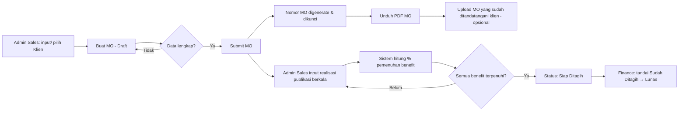

# PRD — Sistem Manajemen Klien & Media Order (MO) Inilah.com

| Atribut | Nilai |
|---|---|
| Nama Produk | Inilah Client & Media Order Management (Oplah) |
| Pemilik Produk | PT Indonesia News Center (Inilah.com) |
| Versi Dokumen | 1.0 |
| Target Pembaca | AI coding agent & tim engineering |
| Tech Stack | React JS (frontend), Node.js (backend), PostgreSQL (database) |
| Bahasa UI | Bahasa Indonesia |

---

## 0. Instruksi untuk AI Agent

Baca bagian ini sebelum menulis kode apa pun.

1. Kerjakan fitur **berurutan sesuai milestone** di Bagian 13. Jangan loncat ke milestone berikutnya sebelum acceptance criteria milestone saat ini lulus.
2. Semua perhitungan uang **wajib** dilakukan di backend dengan tipe integer (Rupiah penuh, tanpa desimal) atau `NUMERIC(18,2)` di PostgreSQL. Jangan pernah memakai `float` JavaScript untuk nominal. Frontend hanya menampilkan hasil dari backend.
3. Rumus pajak di Bagian 7 adalah **sumber kebenaran tunggal**. Buat satu modul `tax.service` yang dipakai di semua tempat, lengkap dengan unit test memakai contoh angka dari dokumen acuan (Subtotal Rp 20.000.000 → Total Rp 22.200.000).
4. Output PDF MO harus **menyerupai tata letak dokumen MO acuan** (lihat Bagian 8). Lakukan visual check terhadap contoh.
5. Setiap endpoint harus dilindungi RBAC (Bagian 3). Jangan mengandalkan penyembunyian tombol di frontend sebagai kontrol akses.
6. Jika ada ambiguitas yang tidak dijawab dokumen ini, pilih opsi paling sederhana, catat asumsi di `docs/ASSUMPTIONS.md`, lalu lanjutkan.
7. Gunakan TypeScript di frontend dan backend.

---

## 1. Latar Belakang

Saat ini tim Admin Sales Inilah.com membuat dokumen Media Order (MO) secara manual (spreadsheet → PDF). Akibatnya:

- Penomoran MO rawan duplikat atau terlewat.
- Perhitungan DPP/PPN dilakukan manual dan berisiko salah.
- Finance tidak punya satu tempat untuk melihat daftar MO per periode.
- Realisasi benefit (artikel, posting sosial media, videotorial) tidak tercatat terpusat, sehingga Finance sulit memastikan apakah seluruh benefit sudah terpenuhi sebelum menagih klien.

## 2. Tujuan & Metrik Keberhasilan

| Tujuan | Metrik |
|---|---|
| Mempercepat pembuatan MO | Waktu input hingga PDF terunduh < 5 menit per MO |
| Menghilangkan kesalahan hitung pajak | 0 selisih perhitungan DPP/PPN/Total |
| Nomor MO unik & berurutan | 0 duplikasi nomor MO |
| Transparansi realisasi benefit | 100% MO aktif memiliki status pemenuhan benefit yang terlihat Finance |
| Mempercepat keputusan penagihan | Finance dapat memfilter MO "Siap Ditagih" dalam 1 klik |

### Di luar cakupan (v1)

- Pembuatan faktur pajak / e-Faktur dan integrasi Coretax.
- Pembuatan invoice PDF otomatis (v1 hanya mencatat status penagihan; lihat Bagian 15 untuk fase 2).
- Integrasi otomatis ke API Instagram/TikTok/X untuk mengambil data publikasi.
- Tanda tangan elektronik tersertifikasi.

---

## 3. Pengguna & Hak Akses (RBAC)

| Role | Deskripsi |
|---|---|
| **Super Admin** | Mengelola user, role, master data, penandatangan, pengaturan penomoran & pajak. |
| **Admin Sales** | Mengelola data klien, membuat/mengedit/submit MO, mengunduh PDF MO, menginput realisasi publikasi. |
| **Finance** | Melihat daftar MO per periode, melihat status pemenuhan benefit, mengubah status penagihan, ekspor data. |
| **Viewer / Manajemen** (opsional) | Read-only seluruh data dan dashboard. |

### Matriks izin

| Aksi | Super Admin | Admin Sales | Finance | Viewer |
|---|:-:|:-:|:-:|:-:|
| Kelola user & role | ✅ | ❌ | ❌ | ❌ |
| Kelola master data (sales, penandatangan, produk, benefit) | ✅ | ❌ | ❌ | ❌ |
| CRUD klien | ✅ | ✅ | 👁 | 👁 |
| Buat & edit MO (status Draft) | ✅ | ✅ | ❌ | ❌ |
| Submit MO | ✅ | ✅ | ❌ | ❌ |
| Batalkan MO | ✅ | ✅ (dengan alasan) | ❌ | ❌ |
| Unduh PDF MO | ✅ | ✅ | ✅ | ✅ |
| Input realisasi publikasi | ✅ | ✅ | ❌ | ❌ |
| Lihat daftar MO & laporan Finance | ✅ | ✅ | ✅ | ✅ |
| Ubah status penagihan | ✅ | ❌ | ✅ | ❌ |
| Ekspor Excel/CSV | ✅ | ✅ | ✅ | ❌ |

> Catatan SaaS: seluruh tabel utama memiliki kolom `organization_id` agar sistem siap multi-tenant, walaupun v1 hanya dipakai satu organisasi (PT Indonesia News Center).

---

## 4. Alur Kerja Utama



### Status MO (`mo_status`)

| Status | Arti | Transisi yang diizinkan |
|---|---|---|
| `DRAFT` | Sedang diisi, bisa diedit, belum punya nomor final | → `SUBMITTED`, dihapus |
| `SUBMITTED` | Sudah final, nomor MO terkunci, PDF bisa diunduh | → `ACTIVE`, → `CANCELLED` |
| `ACTIVE` | MO sudah ditandatangani klien / periode tayang berjalan | → `COMPLETED`, → `CANCELLED` |
| `COMPLETED` | Seluruh benefit terpenuhi (otomatis) | — |
| `CANCELLED` | Dibatalkan, wajib alasan, nomor tidak dipakai ulang | — |

Untuk menyederhanakan, transisi `SUBMITTED → ACTIVE` terjadi otomatis saat realisasi publikasi pertama diinput **atau** saat dokumen bertanda tangan klien diupload, mana yang lebih dulu.

### Status Penagihan (`billing_status`) — dikelola Finance

| Status | Arti |
|---|---|
| `NOT_READY` | Benefit belum terpenuhi 100% (otomatis) |
| `READY_TO_BILL` | Benefit terpenuhi 100% (otomatis), menunggu keputusan Finance |
| `BILLED` | Finance sudah mengirim tagihan (input no. invoice & tanggal) |
| `PAID` | Pembayaran diterima (input tanggal bayar & nominal) |

Finance boleh mengubah ke `BILLED` walau status masih `NOT_READY` (misalnya ada termin pembayaran di tanggal tertentu seperti pada contoh MO), tetapi sistem wajib menampilkan konfirmasi peringatan dan mencatat alasannya.

---

## 5. Kebutuhan Fungsional

### 5.1 Autentikasi

- **FR-AUTH-01** Login dengan email + password (bcrypt/argon2), sesi berbasis JWT access token (15 menit) + refresh token (httpOnly cookie, 7 hari).
- **FR-AUTH-02** Lupa password via email reset link.
- **FR-AUTH-03** Akun bisa dinonaktifkan oleh Super Admin tanpa menghapus histori.

### 5.2 Master Data (Super Admin)

- **FR-MD-01 Sales**: nama, kode sales (untuk penomoran bila diperlukan), email, status aktif. Satu sales dapat ditautkan ke satu akun user.
- **FR-MD-02 Penandatangan**: nama, jabatan, gambar tanda tangan (PNG transparan), peran di dokumen (`DIBUAT_OLEH`, `DIKETAHUI_OLEH`, `DISETUJUI_OLEH`), gambar stempel perusahaan (opsional, khusus `DISETUJUI_OLEH`). Default saat ini:
  - Dibuat oleh: Sales yang bersangkutan (jabatan "Sales")
  - Diketahui oleh: Fitriyanti K — SPV Marketing & Sales
  - Disetujui oleh: Alvin Alverdian — Chief Business Officer (+ stempel)
- **FR-MD-03 Jenis Benefit**: daftar benefit yang bisa dipakai di MO. Seed awal:
  `ARTIKEL_RILIS` (Artikel Rilis), `INSTAGRAM` (Instagram Feed), `INSTAGRAM_STORY`, `TIKTOK`, `FACEBOOK`, `X`, `VIDEOTORIAL_WEBSITE`. Super Admin dapat menambah jenis baru.
- **FR-MD-04 Opsi Formulir**: daftar pilihan checkbox (Jenis Iklan, Bentuk Kerjasama, Penempatan Iklan, Lokasi Iklan) disimpan sebagai master data agar bisa diubah tanpa deploy. Seed awal sesuai Bagian 6.
- **FR-MD-05 Profil Perusahaan**: nama, alamat, logo, rekening bank tujuan transfer (Bank Mandiri, No. Rek 173.00.2228855.0, a/n PT. Indonesia News Center) — tampil di PDF.
- **FR-MD-06 Pengaturan Pajak**: tarif PPN (default 12%), faktor DPP (default 11/12), mode pembulatan. Perubahan tarif hanya berlaku untuk MO baru; MO lama menyimpan snapshot tarifnya.

### 5.3 Manajemen Klien (Admin Sales)

- **FR-CL-01** CRUD klien dengan field: Nama PIC, Perusahaan/Biro Iklan, Nomor NIK (opsional), Alamat, Kota, Kode Pos, Email, No. Telp, NPWP (opsional, untuk kebutuhan penagihan).
- **FR-CL-02** Pencarian klien berdasarkan nama perusahaan / PIC; cegah duplikat dengan peringatan jika nama perusahaan mirip (case-insensitive, trim).
- **FR-CL-03** Halaman detail klien menampilkan histori seluruh MO klien tersebut.
- **FR-CL-04** Klien bisa dibuat langsung dari form MO (inline "Tambah klien baru").

### 5.4 Pembuatan MO (Admin Sales)

- **FR-MO-01** Form MO memuat seluruh field pada Bagian 6, dibagi dalam section yang sama urutannya dengan dokumen acuan.
- **FR-MO-02** Data klien pada MO disimpan sebagai **snapshot** (salinan) saat submit, sehingga perubahan data klien kemudian tidak mengubah MO yang sudah terbit.
- **FR-MO-03** Perhitungan DPP, PPN, dan Total dihitung otomatis dan ditampilkan real-time (preview di frontend, nilai final dihitung ulang backend saat simpan).
- **FR-MO-04 Benefit**: Admin Sales menambah baris benefit (jenis benefit + kuantitas + catatan opsional). Minimal 1 benefit. Contoh: `ARTIKEL_RILIS` × 12, catatan "Materi Ready To Post".
- **FR-MO-05** Field **Detail Kerjasama** otomatis diisi dari daftar benefit (contoh: "Artikel Release (Materi Ready To Post) 12x"), namun tetap bisa diedit manual sebagai teks bebas multi-baris.
- **FR-MO-06** **Term and Conditions** berupa teks multi-baris (maks. 10 baris). Sediakan template T&C default yang bisa dipilih lalu diedit.
- **FR-MO-07** Simpan sebagai Draft kapan saja; validasi wajib hanya dijalankan saat Submit.
- **FR-MO-08** Saat Submit: validasi, generate nomor MO (Bagian 5.5), simpan snapshot tarif pajak, kunci form (read-only).
- **FR-MO-09** MO yang sudah Submit tidak bisa diedit. Koreksi dilakukan dengan **Revisi**: sistem membatalkan MO lama (status `CANCELLED`, alasan "Direvisi") dan membuat Draft baru yang disalin, dengan nomor revisi tercatat (`revision_of_mo_id`). Realisasi publikasi yang sudah diinput ikut dipindahkan ke MO revisi.
- **FR-MO-10** Tombol **Duplikat MO** untuk membuat Draft baru dari MO lama (berguna untuk perpanjangan kontrak).
- **FR-MO-11** Unduh PDF MO (Bagian 8). PDF untuk status Draft diberi watermark "DRAFT".
- **FR-MO-12** Upload dokumen MO bertanda tangan klien (PDF/JPG/PNG, maks. 10 MB), bisa lebih dari satu file.

### 5.5 Penomoran MO

Format pada dokumen acuan: `___/MO-___/INC/___/2026`. Implementasikan format berikut (dapat dikonfigurasi Super Admin lewat template string):

```
{SEQ:3}/MO-{SALES_CODE}/INC/{MONTH_ROMAN}/{YEAR}
Contoh: 007/MO-BMO/INC/V/2026
```

- `SEQ` berurut per tahun (reset tiap 1 Januari), zero-padded 3 digit.
- `MONTH_ROMAN` dan `YEAR` diambil dari **Tanggal MO**, bukan tanggal submit.
- Generate nomor dalam **transaksi database** dengan row lock pada tabel `mo_sequences` (`SELECT ... FOR UPDATE`) untuk mencegah duplikasi saat submit bersamaan.
- Nomor MO yang dibatalkan tidak dipakai ulang.
- Tambahkan unique constraint pada `(organization_id, mo_number)`.

> Asumsi: arti segmen kedua (`MO-___`) adalah kode sales. Jika ternyata berbeda, cukup ubah template tanpa perubahan kode.

### 5.6 Realisasi Publikasi (Admin Sales)

- **FR-PUB-01** Dari halaman detail MO (status `SUBMITTED`/`ACTIVE`), Admin Sales menambah entri realisasi: jenis benefit (hanya yang ada di MO), tanggal tayang, judul konten, URL publikasi (wajib, validasi format URL), bukti screenshot (opsional, gambar maks. 5 MB), catatan.
- **FR-PUB-02** Input massal: tempel beberapa URL sekaligus (satu per baris) untuk satu jenis benefit dan tanggal yang sama.
- **FR-PUB-03** Sistem mencegah URL yang sama diinput dua kali pada MO yang sama.
- **FR-PUB-04** Sistem menolak realisasi yang melebihi kuantitas benefit, kecuali Admin mencentang "Bonus / melebihi kontrak" (tercatat terpisah dan tidak dihitung melebihi 100%).
- **FR-PUB-05** Tanggal tayang di luar Masa Periode MO memunculkan peringatan (bukan blokir).
- **FR-PUB-06** Entri realisasi bisa diedit/dihapus oleh Admin Sales selama `billing_status` belum `BILLED`. Semua perubahan tercatat di audit log.
- **FR-PUB-07** Tampilkan progress per benefit: `terealisasi / target` beserta progress bar, dan progress total MO.

### 5.7 Perhitungan Pemenuhan Benefit

```
fulfilled_qty(benefit)  = MIN(jumlah realisasi non-bonus, target_qty)
benefit_pct(benefit)    = fulfilled_qty / target_qty
mo_fulfillment_pct      = SUM(fulfilled_qty semua benefit) / SUM(target_qty semua benefit)
is_fully_fulfilled      = semua benefit_pct == 100%
```

- Saat `is_fully_fulfilled` menjadi `true`: `mo_status → COMPLETED` dan `billing_status → READY_TO_BILL` (hanya jika masih `NOT_READY`).
- Jika realisasi dihapus sehingga tidak lagi 100%, status kembali (`ACTIVE`, `NOT_READY`) selama belum `BILLED`.
- Buat notifikasi in-app ke seluruh user Finance saat MO menjadi `READY_TO_BILL`.

### 5.8 Modul Finance

- **FR-FIN-01 Daftar MO** dengan filter:
  - Rentang tanggal berdasarkan pilihan: **Tanggal MO** *atau* **Periode Tayang** (overlap dengan rentang).
  - Perusahaan, Sales, Status MO, Status Penagihan, Status Pemenuhan (Belum / Sebagian / Terpenuhi).
- **FR-FIN-02 Kolom tabel** (wajib sesuai kebutuhan):

  | Kolom | Sumber |
  |---|---|
  | Nomor MO | `media_orders.mo_number` |
  | Tanggal MO | `media_orders.mo_date` |
  | Periode Tayang | `period_start` – `period_end` (format "Jun 2026 – Mei 2027") |
  | Perusahaan / Instansi | snapshot klien |
  | Nama Sales | `sales.name` |
  | Nominal sebelum PPN | `subtotal` |
  | PPN | `ppn_amount` |
  | Nominal setelah PPN | `total_amount` |
  | Benefit: Artikel Rilis | `terealisasi/target` |
  | Benefit: Instagram | `terealisasi/target` |
  | Benefit: Instagram Story | `terealisasi/target` |
  | Benefit: TikTok | `terealisasi/target` |
  | Benefit: Facebook | `terealisasi/target` |
  | Benefit: X | `terealisasi/target` |
  | Benefit: Videotorial Website | `terealisasi/target` |
  | % Pemenuhan | `mo_fulfillment_pct` |
  | Status Penagihan | `billing_status` |

  Sel benefit menampilkan "—" jika benefit tidak ada di MO; berwarna hijau jika terpenuhi, kuning jika sebagian, abu-abu jika belum ada realisasi. Kolom benefit dibangkitkan dari master `benefit_types` agar benefit baru otomatis muncul.
- **FR-FIN-03** Baris ringkasan (footer) total Nominal sebelum PPN, PPN, dan setelah PPN sesuai filter aktif.
- **FR-FIN-04** Klik baris membuka detail MO (read-only) beserta daftar realisasi publikasi dan link-nya, sehingga Finance bisa memverifikasi.
- **FR-FIN-05** Ubah status penagihan: `BILLED` (wajib: nomor invoice, tanggal invoice, nominal ditagih) dan `PAID` (wajib: tanggal bayar, nominal diterima, No. Kwitansi opsional). Mendukung penagihan bertahap (lebih dari satu record tagihan per MO); status `PAID` hanya jika total dibayar ≥ total MO.
- **FR-FIN-06** Ekspor daftar ke **Excel (.xlsx)** dan CSV sesuai filter aktif, dengan angka sebagai tipe numerik (bukan teks).
- **FR-FIN-07** Dashboard ringkas: jumlah MO & nilai total per bulan, jumlah MO `READY_TO_BILL`, nilai piutang (`BILLED` belum `PAID`).

### 5.9 Audit Log & Notifikasi

- **FR-AUD-01** Catat create/update/delete/submit/cancel/perubahan status penagihan: user, waktu, entitas, nilai sebelum & sesudah (JSONB).
- **FR-NOT-01** Notifikasi in-app (ikon lonceng): MO siap ditagih (ke Finance), MO mendekati akhir periode tayang (H-30) dengan pemenuhan < 100% (ke Admin Sales pembuat).

---

## 6. Spesifikasi Field Form MO

Urutan section mengikuti dokumen MO acuan.

### Section A — Header

| Field | Tipe | Wajib | Catatan |
|---|---|:-:|---|
| No. Media Order | auto | — | Digenerate saat submit, tampil "(otomatis)" saat Draft |
| Tanggal | date | ✅ | Default hari ini. Tampil di PDF: "22 Mei 2026" |

### Section B — Data Klien (snapshot)

| Field | Tipe | Wajib |
|---|---|:-:|
| Nama (PIC) | text | ✅ |
| Perusahaan / Biro Iklan | text | ✅ |
| Nomor NIK | text (16 digit) | ❌ |
| Alamat | textarea | ❌ |
| Kota | text | ❌ |
| Kode Pos | text (5 digit) | ❌ |
| Email | email | ✅ |
| No. Telp | text | ✅ |

> Pada contoh MO beberapa field klien kosong, maka hanya Nama PIC, Perusahaan, Email, No. Telp yang wajib. Bisa diubah lewat konfigurasi.

### Section C — Periode

| Field | Tipe | Wajib | Catatan |
|---|---|:-:|---|
| Masa Periode | month range (`period_start`, `period_end`) | ✅ | Disimpan sebagai tanggal awal bulan & akhir bulan. PDF: "Juni 2026 - Mei 2027" |
| Keterangan | text | ✅ | Contoh: "Publikasi Rilis Artikel" |

### Section D — Detail Iklan

| Field | Tipe | Wajib | Opsi |
|---|---|:-:|---|
| Tanggal Tayang | text/date | ❌ | Teks bebas (bisa "Sesuai jadwal") |
| Jenis Iklan | multi-checkbox | ❌ | Banner, Advertorial, Lipsus, Mikrosite, Artikel, Artikel + Backlink, Video |
| Bentuk Kerjasama | single-checkbox (boleh kosong) | ❌ | Full Barter, Semi Barter |
| Penempatan Iklan | multi-checkbox | ❌ | Halaman Depan, Halaman Detail, Halaman Kanal |
| Lokasi Iklan – Spot Ads Website | checkbox + multi-checkbox anak | ❌ | Billboard 970x250, Single Skyscraper 160x600, Full Skyscraper 2 (160x600), Medium Rectangle 300x250, Leaderboard One 728x90, Full Leaderboard 970x90, Bottom Full Leaderboard 970x90, Sticky Footer 970x90, Pop-up Custom |
| Lokasi Iklan – Spot Ads Mobile | checkbox | ❌ | — |
| Benefit | tabel dinamis | ✅ (min. 1) | Jenis benefit + qty (integer ≥ 1) + catatan |
| Detail Kerjasama | textarea (maks. 4 baris) | ✅ | Auto-generate dari benefit, bisa diedit |
| Term and Conditions | textarea (maks. 10 baris) | ❌ | Template default tersedia |

Opsi anak pada Spot Ads Website hanya aktif jika induknya dicentang.

### Section E — Pembayaran

| Field | Tipe | Wajib | Catatan |
|---|---|:-:|---|
| Cara Pembayaran | select | ✅ | Transfer, Cek/BG |
| Cek/BG No | text | kondisional | Wajib jika Cek/BG |
| Kwitansi No | text | ❌ | |
| Jatuh Tempo Pembayaran | date / text | ❌ | |
| Produk Iklan | text | ❌ | |
| Subtotal | currency (integer Rupiah) | ✅ | > 0 |
| DPP 11/12 | auto | — | Bagian 7 |
| PPN 12% | auto | — | Bagian 7 |
| Total Payment | auto | — | Bagian 7 |
| Kena PPN | toggle | ✅ | Default ON. Jika OFF, PPN = 0, baris DPP & PPN tidak tampil di PDF |

### Section F — Penandatangan

| Field | Tipe | Default |
|---|---|---|
| Dibuat oleh | select sales | Sales pada MO |
| Diketahui oleh | select penandatangan | Fitriyanti K |
| Disetujui oleh | select penandatangan | Alvin Alverdian |

---

## 7. Aturan Perhitungan Pajak

Mengacu pada contoh MO (PPN 12% dengan DPP nilai lain 11/12):

```
DPP   = ROUND_HALF_UP(Subtotal × 11 / 12)
PPN   = ROUND_HALF_UP(DPP × 12 / 100)
Total = Subtotal + PPN
```

Validasi dengan data acuan:

| Subtotal | DPP | PPN | Total |
|---:|---:|---:|---:|
| 20.000.000 | 18.333.333 | 2.200.000 | 22.200.000 |

Catatan penting untuk implementasi:

- `ROUND_HALF_UP(18.333.333 × 0,12) = 2.199.999,96 → 2.200.000`. Hitung dengan aritmetika integer/decimal (mis. library `decimal.js` di Node atau `NUMERIC` di PostgreSQL), bukan float.
- Total = **Subtotal + PPN** (bukan DPP + PPN).
- Simpan `dpp_amount`, `ppn_amount`, `total_amount`, `ppn_rate`, `dpp_factor_num`, `dpp_factor_den` di tabel MO sebagai snapshot.
- Unit test minimal: contoh di atas, subtotal 1, subtotal 12, subtotal 999.999.999, dan mode "tidak kena PPN".
- Format tampilan Rupiah: pemisah ribuan titik, tanpa desimal (`20.000.000`).

---

## 8. Spesifikasi PDF MO

- Ukuran A4 portrait, satu halaman (jika Detail Kerjasama/T&C panjang, font mengecil hingga batas minimum 7pt; jika masih tidak muat, lanjut ke halaman 2).
- Dibangkitkan di **backend** menggunakan **Puppeteer** (render template HTML + CSS khusus print) agar tampilan identik di semua perangkat.
- Elemen tata letak sesuai dokumen acuan:
  1. **Header** gelap berisi logo Inilah.com, nama & alamat perusahaan di kiri, judul **"MEDIA ORDER"** besar di kanan, diikuti garis merah tebal.
  2. Kotak No. Media Order & Tanggal.
  3. Kotak data klien: kolom kiri (Nama, Perusahaan/Biro Iklan, Nomor NIK, Alamat), kolom kanan (Kota, Kode Pos, Email, No. Telp).
  4. Kotak Masa Periode & Keterangan.
  5. Kotak detail iklan: Tanggal Tayang, checkbox Jenis Iklan, Bentuk Kerjasama, Penempatan Iklan, Lokasi Iklan (semua opsi selalu dicetak; opsi terpilih ditampilkan tercentang ☑), Detail Kerjasama (bergaris), Term and Conditions (bergaris).
  6. Kotak pembayaran: Cara Pembayaran, Cek/BG No, Transfer, Kwitansi No, Jatuh Tempo; rincian Biaya Pemasangan (Produk Iklan, Subtotal, DPP 11/12, PPN 12%, Total Payment tebal) dengan tanda "(+)" di baris PPN; area "Menyetujui, Tanda Tangan / Stampel Pengiklan" kosong; info rekening tujuan transfer.
  7. Area tanda tangan tiga kolom: Dibuat oleh / Diketahui oleh / Disetujui oleh, dengan gambar tanda tangan, nama tebal, jabatan (jabatan CBO dicetak miring), dan stempel di kolom "Disetujui oleh".
- Tanda tangan & stempel **hanya dicetak untuk MO berstatus SUBMITTED ke atas**; Draft diberi watermark "DRAFT" tanpa tanda tangan.
- Nama file: `MO_{nomor-mo-dengan-tanda-strip}_{NAMA_PERUSAHAAN}_{PERIODE}.pdf`, contoh `MO_007-MO-BMO-INC-V-2026_PT_BUKIT_ASAM_Juni_2026-Mei_2027.pdf`.
- Hasil PDF final disimpan (object storage) saat submit agar dokumen yang diunduh selalu sama; tersedia tombol "Generate ulang" khusus Super Admin.

---

## 9. Model Data (PostgreSQL)

Semua tabel memiliki `id UUID PK`, `created_at`, `updated_at`, dan (kecuali tabel global) `organization_id`. Soft delete via `deleted_at` untuk `clients`, `users`.

```sql
organizations (id, name, address, logo_url, bank_name, bank_account_no, bank_account_name, settings JSONB)

users (id, organization_id, name, email UNIQUE, password_hash, role, is_active, sales_id NULL)
-- role: SUPER_ADMIN | ADMIN_SALES | FINANCE | VIEWER

sales (id, organization_id, name, code, email, is_active)

signatories (id, organization_id, name, title, doc_role, signature_url, stamp_url, is_default, is_active)
-- doc_role: CREATED_BY | ACKNOWLEDGED_BY | APPROVED_BY

clients (id, organization_id, pic_name, company_name, nik, address, city, postal_code,
         email, phone, npwp, notes, deleted_at)

benefit_types (id, organization_id, code, name, sort_order, is_active)

form_options (id, organization_id, group, code, label, parent_code NULL, sort_order, is_active)
-- group: AD_TYPE | COOP_TYPE | PLACEMENT | AD_LOCATION

mo_sequences (organization_id, year, last_seq, PRIMARY KEY (organization_id, year))

media_orders (
  id, organization_id, mo_number NULL, mo_date,
  client_id, client_snapshot JSONB,
  sales_id, period_start DATE, period_end DATE, description,
  airing_date_text, selected_options JSONB,       -- kode opsi checkbox terpilih
  cooperation_detail TEXT, terms_conditions TEXT,
  payment_method, cheque_no, receipt_no, due_date_text, ad_product,
  is_taxable BOOLEAN, subtotal NUMERIC(18,2), dpp_amount NUMERIC(18,2),
  ppn_amount NUMERIC(18,2), total_amount NUMERIC(18,2),
  ppn_rate NUMERIC(5,2), dpp_factor_num INT, dpp_factor_den INT,
  created_by_signatory JSONB, acknowledged_by_signatory_id, approved_by_signatory_id,
  status, billing_status, cancel_reason, revision_of_mo_id NULL,
  pdf_url, submitted_at, submitted_by, created_by,
  UNIQUE (organization_id, mo_number)
)

mo_benefits (id, media_order_id, benefit_type_id, target_qty INT CHECK (target_qty > 0), notes,
             UNIQUE (media_order_id, benefit_type_id))

publications (id, media_order_id, mo_benefit_id, published_date, title, url, screenshot_url,
              is_bonus BOOLEAN DEFAULT false, notes, created_by,
              UNIQUE (media_order_id, url))

mo_attachments (id, media_order_id, file_url, file_name, mime_type, size_bytes, uploaded_by)

billings (id, media_order_id, invoice_no, invoice_date, amount, paid_date NULL,
          paid_amount NULL, receipt_no NULL, notes, override_reason NULL, created_by)

notifications (id, user_id, type, payload JSONB, read_at)

audit_logs (id, organization_id, user_id, entity, entity_id, action, before JSONB, after JSONB, created_at)
```

**Index yang disarankan:** `media_orders(organization_id, mo_date)`, `media_orders(organization_id, period_start, period_end)`, `media_orders(billing_status)`, `publications(mo_benefit_id)`, `clients` trigram index pada `company_name` untuk pencarian.

**View untuk laporan Finance:** buat view/materialized query `v_mo_finance` yang melakukan pivot jumlah realisasi per `benefit_type.code` agar endpoint daftar Finance cukup satu query.

---

## 10. Spesifikasi API (REST, prefix `/api/v1`)

| Method | Endpoint | Role | Keterangan |
|---|---|---|---|
| POST | `/auth/login` | publik | |
| POST | `/auth/refresh` | publik | |
| POST | `/auth/logout` | semua | |
| POST | `/auth/forgot-password`, `/auth/reset-password` | publik | |
| GET/POST/PATCH | `/users` | SA | |
| CRUD | `/sales`, `/signatories`, `/benefit-types`, `/form-options` | SA (GET: semua) | |
| GET/PATCH | `/settings` | SA | pajak, penomoran, profil perusahaan |
| CRUD | `/clients` | SA, AS (GET: semua) | `?q=` pencarian |
| GET | `/media-orders` | semua | filter: `date_field=mo_date|period`, `from`, `to`, `client_id`, `sales_id`, `status`, `billing_status`, `fulfillment=none|partial|full`, `page`, `limit`, `sort` |
| POST | `/media-orders` | SA, AS | buat Draft |
| GET | `/media-orders/:id` | semua | termasuk benefit, progress, lampiran, tagihan |
| PATCH | `/media-orders/:id` | SA, AS | hanya status DRAFT |
| DELETE | `/media-orders/:id` | SA, AS | hanya status DRAFT |
| POST | `/media-orders/:id/submit` | SA, AS | |
| POST | `/media-orders/:id/cancel` | SA, AS | body: `reason` |
| POST | `/media-orders/:id/revise` | SA, AS | |
| POST | `/media-orders/:id/duplicate` | SA, AS | |
| GET | `/media-orders/:id/pdf` | semua | stream file PDF |
| POST | `/media-orders/:id/attachments` | SA, AS | multipart |
| POST | `/media-orders/calculate` | SA, AS | body: `subtotal`, `is_taxable` → DPP/PPN/Total (untuk preview) |
| GET/POST | `/media-orders/:id/publications` | GET semua; POST SA, AS | POST mendukung array (bulk) |
| PATCH/DELETE | `/publications/:id` | SA, AS | ditolak jika MO sudah BILLED |
| POST | `/media-orders/:id/billings` | SA, FIN | tandai BILLED |
| PATCH | `/billings/:id` | SA, FIN | catat pembayaran |
| GET | `/finance/media-orders/export` | SA, AS, FIN | `?format=xlsx|csv` + filter yang sama |
| GET | `/finance/dashboard` | SA, FIN, VIEWER | |
| GET/PATCH | `/notifications` | semua | |

Format error standar:

```json
{ "error": { "code": "VALIDATION_ERROR", "message": "Subtotal wajib diisi", "details": [{ "field": "subtotal", "message": "..." }] } }
```

Validasi request memakai **Zod** (skema dibagikan antara frontend & backend lewat package `shared`).

---

## 11. Arsitektur & Stack Teknis

| Lapisan | Pilihan |
|---|---|
| Frontend | React 18 + TypeScript + Vite, React Router, TanStack Query, React Hook Form + Zod, Tailwind CSS + shadcn/ui, TanStack Table untuk tabel Finance |
| Backend | Node.js 20 LTS + TypeScript, Express (atau NestJS), Prisma ORM |
| Database | PostgreSQL 16 |
| PDF | Puppeteer (Chromium headless) + template HTML (Handlebars) |
| Excel | ExcelJS |
| Angka/uang | decimal.js |
| Penyimpanan file | S3-compatible (MinIO untuk lokal) |
| Auth | JWT + refresh token httpOnly cookie, bcrypt |
| Testing | Vitest (unit), Supertest (API), Playwright (E2E) |
| Deployment | Docker + docker-compose (app, db, minio) |

### Struktur repo (monorepo, pnpm workspaces)

```
/apps
  /web        # React
  /api        # Node.js
/packages
  /shared     # Zod schema, tipe, konstanta enum, util format Rupiah & tanggal Indonesia
/docs
  PRD.md
  ASSUMPTIONS.md
docker-compose.yml
```

---

## 12. Kebutuhan Non-Fungsional

- **Keamanan**: HTTPS, helmet, rate limit login (5 percobaan/menit), validasi tipe & ukuran file upload, URL file privat dengan signed URL berumur pendek, tidak ada data sensitif (NIK) di log.
- **Performa**: daftar Finance dengan 10.000 MO dan filter aktif merespons < 1 detik; generate PDF < 5 detik.
- **Ketersediaan data**: backup PostgreSQL harian, retensi 30 hari.
- **Lokalisasi**: format tanggal Indonesia ("22 Mei 2026"), nama bulan Indonesia, zona waktu `Asia/Jakarta`, format Rupiah.
- **Responsif**: optimal di desktop (≥ 1280px); halaman input realisasi publikasi tetap nyaman di mobile.
- **Aksesibilitas**: label pada setiap input, navigasi keyboard pada form.

---

## 13. Milestone & Acceptance Criteria

### M1 — Fondasi
- Setup monorepo, Docker, Prisma schema & migration, seed data (organisasi, admin, benefit types, form options, penandatangan default).
- Auth + RBAC middleware.
- **AC**: user dari tiap role dapat login; endpoint yang tidak diizinkan mengembalikan 403.

### M2 — Master Data & Klien
- Halaman master data (SA) dan CRUD klien.
- **AC**: klien dapat dibuat, dicari, diedit; peringatan duplikat muncul untuk nama perusahaan yang sama.

### M3 — Pembuatan MO & PDF
- Form MO lengkap, kalkulasi pajak, draft/submit, penomoran, PDF, revisi, duplikat, upload lampiran.
- **AC**:
  - Input data contoh (PT Bukit Asam Tbk, periode Juni 2026–Mei 2027, Artikel Rilis 12x, subtotal Rp 20.000.000) menghasilkan DPP 18.333.333, PPN 2.200.000, Total 22.200.000.
  - PDF yang dihasilkan memiliki seluruh section dokumen acuan dengan urutan yang sama.
  - 20 request submit paralel menghasilkan 20 nomor MO unik dan berurutan.
  - MO berstatus SUBMITTED tidak dapat diubah via API (409).

### M4 — Realisasi Publikasi
- Input tunggal & massal, progress per benefit, auto status COMPLETED/READY_TO_BILL.
- **AC**: memasukkan 12 URL artikel pada MO contoh mengubah progress menjadi 100%, status MO menjadi COMPLETED, billing_status READY_TO_BILL, dan user Finance menerima notifikasi.

### M5 — Modul Finance
- Daftar MO dengan filter, kolom sesuai Bagian 5.8, footer total, detail, status penagihan, ekspor, dashboard.
- **AC**: filter "Periode Tayang Juli 2026" memunculkan MO contoh (karena periodenya overlap); ekspor Excel berisi kolom dan angka yang sama dengan tabel di layar.

### M6 — Hardening
- Audit log, notifikasi H-30, E2E test alur utama, dokumentasi deployment.
- **AC**: E2E Playwright "buat klien → buat MO → submit → unduh PDF → input realisasi → Finance tandai BILLED → PAID" lulus.

---

## 14. Data Contoh untuk Seed & Test

```json
{
  "client": {
    "company_name": "PT Bukit Asam Tbk (PTBA)",
    "pic_name": "(isi PIC)",
    "email": "pic@example.com",
    "phone": "0800000000"
  },
  "media_order": {
    "mo_date": "2026-05-22",
    "period_start": "2026-06-01",
    "period_end": "2027-05-31",
    "description": "Publikasi Rilis Artikel",
    "benefits": [{ "code": "ARTIKEL_RILIS", "target_qty": 12, "notes": "Materi Ready To Post" }],
    "cooperation_detail": "Artikel Release (Materi Ready To Post) 12x",
    "terms_conditions": "Kerjasama ini tidak mencakup penjagaan narasi pemberitaan di Inilah.com, PTBA hanya membeli inventori rilis artikel.\nPembayaran pada bulan September 2026 setelah PKS selesai ditandatangan kedua pihak.\nWaktu operasional produksi konten pukul 09:00 - 21:00",
    "payment_method": "TRANSFER",
    "is_taxable": true,
    "subtotal": 20000000,
    "sales": "Bimo",
    "acknowledged_by": "Fitriyanti K",
    "approved_by": "Alvin Alverdian"
  },
  "expected": { "dpp": 18333333, "ppn": 2200000, "total": 22200000 }
}
```

---

## 15. Rencana Fase Berikutnya (tidak dikerjakan di v1)

- Generate invoice PDF & kwitansi otomatis dari data MO.
- Portal klien untuk melihat laporan realisasi publikasi (link share read-only).
- Integrasi API sosial media untuk verifikasi otomatis & statistik (views, likes).
- Pengingat email/WhatsApp untuk MO mendekati akhir periode.
- Approval MO bertingkat di dalam sistem (SPV → CBO) sebelum tanda tangan tercetak.
- Multi-tenant penuh (registrasi organisasi, billing langganan SaaS).

## 16. Asumsi & Pertanyaan Terbuka

| # | Asumsi / Pertanyaan | Default yang dipakai |
|---|---|---|
| 1 | Arti segmen penomoran `MO-___` dan segmen setelah `INC/` | Kode sales & bulan romawi (dapat dikonfigurasi) |
| 2 | Apakah MO perlu approval internal di sistem sebelum tanda tangan dicetak? | Tidak di v1; tanda tangan tercetak otomatis saat submit |
| 3 | Apakah satu MO bisa ditagih bertahap (termin)? | Ya, didukung lewat banyak record `billings` |
| 4 | Apakah realisasi "Instagram" mencakup Reels? | Ya, Reels dicatat sebagai Instagram kecuali dibuat jenis benefit terpisah |
| 5 | Apakah Admin Sales hanya melihat MO miliknya sendiri? | Tidak, seluruh Admin Sales melihat semua MO (dapat dibatasi lewat setting) |
